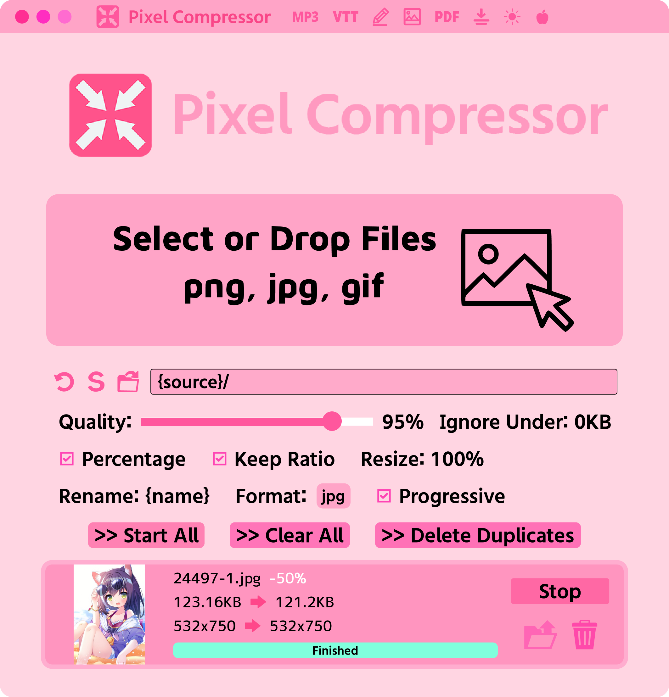

## Pixel Compressor

A cute image compressor!

### Features:
- Compress and resize images (JPG, PNG, WEBP, AVIF)
- Compress and resize GIFs
- Preview before and after images (right click on the thumbnails)
- Delete duplicate images (found by perceptual hash)

### Rename Template:
These are all the special name replacements:

{name} - The name of the original file. \
{width} - The destination width. \
{height} - The destination height. \
{title} - The title of the Pixiv illustration, if found. \
{englishTitle} - The title but translated to English. \
{id} - The ID of the Pixiv illustration, if found. \
{artist} - The artist of the Pixiv illustration, if found.

### Titlebar Buttons
There are many utility functions on the titlebar. They do the following:

VTT - If ASS or SRT files are selected, they will be converted to VTT subtitles.

Rename - Select files within a directory and they will be renamed chronologically. For instance, if the directory is named "Yuru Yuri" the files will be renamed "Yuru Yuri 1", "Yuru Yuri 2", etc. going by alphabetic order.

Image - Converts double pages to single pages (images with twice the width of all others).

PDF -  If PDF files are selected, it converts it into a directory of images. If images are selected, it merges them into a PDF.

Flatten - Flattens a directory, so that all files in all sub-directories are moved to the top level. This attempts to prevent naming conflicts by renaming files if the name would conflict with another.

### Keyboard Shortcuts
- Ctrl O - Open images
- Drag and drop - Open images

### Design

Our design is available here: https://www.figma.com/design/lTUtTd5bAHSxvg3uTzNWIA/Pixel-Compressor

### Purchase

  

Linux version is free and available in [releases](https://github.com/Moebytes/Pixel-Compressor/releases).

### Also See

- [Waifu2x Upscaler](https://github.com/Moebytes/Waifu2x-Upscaler)

